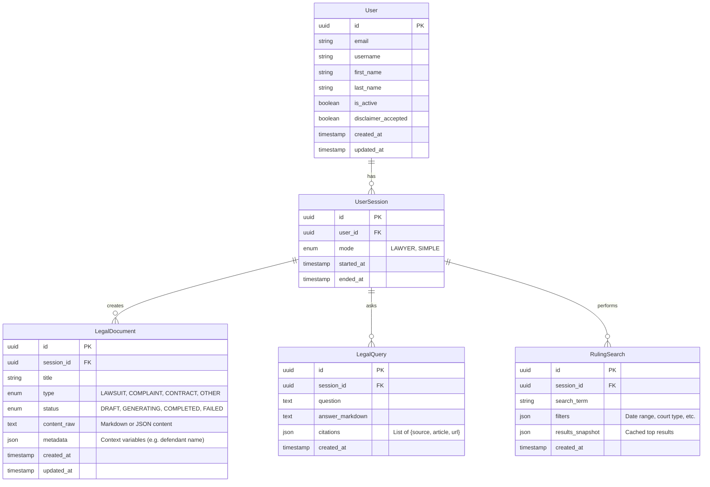

# Data Model

## Conceptual Model

## Entities & Aggregates (DDD)

### User Aggregate

- **Root**: `User`
- **Purpose**: Represents a user in the system with their profile and consent status.
- **Invariants**: A valid user must have a unique email. The `disclaimer_accepted` flag tracks legal consent globally for the user.

### Session Aggregate

- **Root**: `UserSession`
- **Purpose**: Tracks the "Context" (Lawyer vs Simple mode) per session.
- **Invariants**: A valid `UserSession` requires the associated `User` to have `disclaimer_accepted = true` before allowing creation of `LegalDocument` or `LegalQuery`.

### Document Aggregate

- **Root**: `LegalDocument`
- **Invariants**:
  - A document cannot be marked `COMPLETED` without content.
  - `content_raw` must be valid string/json.

### Inquiry Aggregate

- **Root**: `LegalQuery`
- **Purpose**: Stores the history of "Chat" with the AI.
- **Notes**: Citations are stored as a structured JSON value object to allow rendering links.

### Search Aggregate

- **Root**: `RulingSearch`
- **Purpose**: Audit log of searches performed and potentially cached results.

## Database Schema (PostgreSQL)

We will use `nestjs-query` compatible entities (TypeORM or Sequelize, likely TypeORM/MikroORM implies standard relational tables).

- `users` (Managed by Auth/Identity module, referenced by UUID)
- `legal_documents`
- `legal_queries`
- `ruling_searches`
